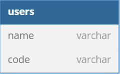

# Documentação da API

## Arquitetura do projeto

A arquitetura escolhida para o desenvolvimento do projeto foi em camadas:

**Controller**: Responsável pela lógica de apresentação dos dados. Além disso, é responsável por realizar o contato com a camada de serviço.

**Serviço**: Nessa camada é encontrada a lógica do negócio, ou seja, lógica de validações de CPF/CNPJ. Com essa camada, conseguimos isolar o nível lógico e o framework. O que facilita caso seja alterada a apresentação dos dados.

**Repositório**: O repositório centraliza a lógica de acesso a dados em um único lugar, abstraindo as operações de persistência e recuperação de dados.

## Estrutura do Projeto

Este projeto é uma API desenvolvida com o framework Gin para Go. A estrutura do repositório é organizada da seguinte forma:

```
├── Dockerfile
├── app
│ ├── api
│ │ └── server.go
│ ├── controllers
│ │ └── user_controller.go
│ ├── domain
│ │ └── user.go
│ ├── infra
│ │ ├── config
│ │ │ └── env.go
│ │ └── database
│ │ ├── database.go
│ │ └── queries.go
│ ├── middlewares
│ │ └── metrics.go
│ ├── repositories
│ │ ├── interfaces
│ │ │ └── user_repository.go
│ │ ├── user_repository_memory.go
│ │ └── user_repository_pgsql.go
│ ├── services
│ │ └── user.go
│ ├── setup
│ │ └── data_loader.go
│ └── types
│ └── error.go
├── data.csv
├── docker-compose.yml
├── go.mod
├── go.sum
└── main.go
```

## Componentes do Projeto

### 1. **api**

- **server.go**: Configura e inicializa o servidor Gin. Define as rotas e middlewares principais da aplicação.

### 2. **controllers**

- **user_controller.go**: Contém os handlers para as rotas relacionadas aos usuários. Inclui a lógica de controle para operações e endpoints adicionais, como a verificação de uptime do servidor.

### 3. **domain**

- **user.go**: Define as estruturas e modelos de dados relacionados aos usuários. Representa o domínio e a lógica de negócios central.

### 4. **infra**

- **config/env.go**: Carrega e gerencia configurações do ambiente, como variáveis de ambiente e configurações de inicialização.

- **database**:
  - **database.go**: Configura a conexão com o banco de dados.
  - **queries.go**: Define as consultas SQL utilizadas na aplicação.

### 5. **middlewares**

- **metrics.go**: Implementa middlewares para monitoramento e métricas. Pode incluir funcionalidades como registro de desempenho e coleta de métricas.

### 6. **repositories**

- **interfaces/user_repository.go**: Define a interface para o repositório de usuários. Especifica os métodos necessários para acessar e manipular dados de usuários.

- **user_repository_memory.go**: Implementação em memória da interface do repositório de usuários. Útil para testes e desenvolvimento.

- **user_repository_pgsql.go**: Implementação da interface do repositório de usuários usando PostgreSQL. Conecta e interage com o banco de dados.

### 7. **services**

- **user.go**: Contém a lógica de serviço para operações relacionadas aos usuários. Atua como a camada de serviço que orquestra as interações entre controladores e repositórios.

### 8. **types**

- **error.go**: Define tipos e funções relacionados a erros personalizados na aplicação.

## Endpoints da API

### Verificação de Uptime

- **Endpoint**: `GET /uptime`
- **Descrição**: Retorna o tempo de atividade do servidor desde sua inicialização.
- **Resposta**:
```json
{
"status": "up",
"uptime": "X dias Y horas Z minutos W segundos"
}
```

### Busca por CPF/CNPJ

- **Endpoint**: `GET /clients/:code`
- **Descrição**: Retorna o cliente caso ele exista com aquele CPF/CNPJ.
- **Resposta**:
```json
{
"user": "John Doe",
"code": "000.000.000-00"
}
```

### Busca de todos clientes da base

- **Endpoint**: `GET /clients/:code`
- **Descrição**: Retorna todos clientes cadastrados no banco de dados.
- **Resposta**:
```json
[
    {
        "user": "John Doe",
        "code": "000.000.000-00"
    },
    {
        "user": "John Foo",
        "code": "000.000.000-01"
    },
]
```

## Modo de execução:

Para executar a aplicação, é necessário os seguintes requisitos:

- Golang (versão utilizada no projeto 1.23.0)
- Docker

A aplicação é containerizada com o uso do Docker, para executar use o seguinte commando:

```sh
$ docker-compose --build .
```

## Estrutura da tabela

Para o projeto foi utilizado apenas uma estrutura relacional para simplicidade do projeto:


